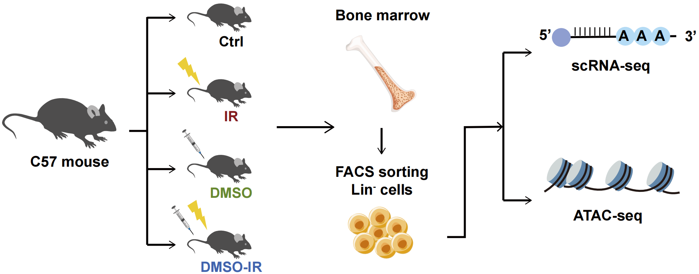

# DMSO-IR-treatment-Multiomics-analysis
Code for manuscript *"Transcriptional Diversity Predicts Hematopoietic Radiosensitivity and Unveils a Pre-adaptive Protection Mechanism by Dimethyl Sulfoxide"*.

  

*Experimental workflow and multi-omics design overview.*
